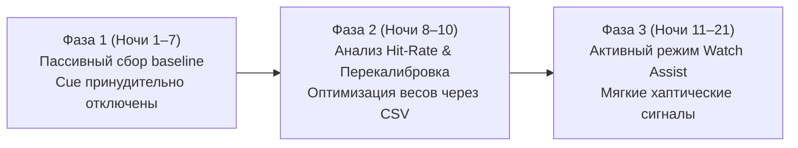

# Протокол пилотного исследования: Lucid Dream MVP (M4)

## 1. Цели и задачи пилота

Цель пилотного этапа — эмпирическая валидация эвристического детектора быстрой фазы сна (`RemConfidenceEngine`) на реальных биометрических сигналах Galaxy Watch (PPG, IBI, акселерометр) и оптимизация весовых коэффициентов без риска фрагментации сна пользователей.

### Ключевые метрики успеха (Success Criteria):
1. **Hit Rate (Sensitivity / Полнота по REM)**: $\ge 70\%$ (минимум 70% окон истинной фазы REM должны определяться алгоритмом с уверенностью выше порога $\theta$).
2. **False Alarm Rate (Ложные срабатывания в N3/N2)**: $\le 15\%$ (не более 15% срабатываний в глубоком медленноволновом сне во избежание сбоя восстановительных процессов).
3. **Wake-Spike Rate (Индекс пробуждений от стимулов)**: $\le 5\%$ всех доставленных триггеров.
4. **Сохранение заряда батареи**: остаток $\ge 30\%$ аккумулятора Galaxy Watch после 8 часов непрерывного ночного трекинга.

---

## 2. Выборка и профиль участников

- **Размер группы**: 5–10 добровольцев.
- **Оборудование**: Samsung Galaxy Watch 4 / 5 / 6 / 7 + смартфон с Android 11+ и установленным Samsung Health.
- **Критерии включения**:
  - Возраст 18–45 лет.
  - Регулярный режим сна (не менее 7 часов за ночь).
  - Отсутствие диагностированных парасомний, апноэ или тяжелой инсомнии.
- **Критерии исключения**:
  - Прием снотворных препаратов или психоактивных веществ.
  - Сменная ночная работа.

---

## 3. Трехфазный протокол исследования



### Фаза 1: Пассивный сбор данных (Дни 1–7)
- **Режим**: `NightMode.BEGINNER` (Passive Data Collection).
- **Поведение системы**:
  - На часах работает `WatchTrackingForegroundService` с адаптивным `BatteryDutyCycleManager`.
  - Сенсоры непрерывно агрегируют 60-секундные `SensorWindow` (HR, RMSSD, SDNN, Movement Index).
  - Вычисляется `rem_confidence` скор.
  - **Аудио и вибро-актуаторы жестко заблокированы** (`isDataSufficient` мониторится, но триггеры не подаются).
- **Утренние действия пользователя**:
  1. Остановка сессии на часах или телефоне.
  2. Заполнение 3-секундного экспресс-опроса (`WatchMorningFeedbackScreen`).
  3. Открытие экрана `Sleep Review` на телефоне, нажатие кнопки **«Export Pilot Dataset (.csv)»** и отправка лога куратору исследования.

### Фаза 2: Валидация и калибровка весов (Дни 8–10)
- Каждое 60-секундное окно сопоставляется с референсной гипнограммой Samsung Health через `PilotValidationEngine`.
- Расчет матрицы ошибок:
  - **True Positive (TP)**: окно с `confidence >= 0.65` попало в стадию REM.
  - **False Positive (FP)**: окно с `confidence >= 0.65` попало в DEEP / LIGHT / AWAKE.
  - **False Negative (FN)**: окно стадии REM не достигло порога уверенности.
- Запуск алгоритма оптимизации `optimizeWeights()`:
  - Автоматическая подгонка четверки $(w_{\text{time}}, w_{\text{motion}}, w_{\text{hrv}}, w_{\text{consistency}})$.
  - Индивидуализация порога `confidenceThreshold` в `UserProfile`.

### Фаза 3: Активная индукция (Дни 11–21)
- **Режим**: `NightMode.WATCH_ASSIST` или `NightMode.TLR`.
- **Поведение**:
  - Подача прогрессивных 3-tap вибраций (`AndroidWatchHapticEngine`, длительность $<520$ мс) только при попадании в подтвержденный REM в окне 4.5–8 часов сна.
  - Автоматическое подавление стимуляции при детекции `wakeSpike` (скачок пульса $>25\%$ или всплеск движения).
  - Мониторинг частоты осознания снов в `DreamJournalScreen`.

---

## 4. Структура экспортируемого датасета (CSV)

Файл `lucid_pilot_<session_id>.csv` содержит следующие поля для каждой минуты ночного мониторинга:

| Колонка | Тип | Описание |
|---|---|---|
| `window_index` | Int | Порядковый номер 60-секундного окна сессии |
| `start_ms` | Long | Начальный Unix-таймстемп окна в миллисекундах |
| `end_ms` | Long | Конечный Unix-таймстемп окна |
| `minutes_from_onset` | Long | Время, прошедшее с момента старта сна (мин) |
| `mean_hr` | Double | Средняя ЧСС за окно (уд/мин) |
| `rmssd` | Double | Вариабельность сердечного ритма (RMSSD в мс) |
| `movementIndex` | Double | Индекс двигательной активности по акселерометру [0.0..1.0] |
| `is_data_sufficient` | Boolean | Достаточно ли сырых сэмплов поступило от сенсоров |
| `rem_confidence` | Double | Вычисленная вероятность REM [0.0..1.0] |
| `ground_truth_stage` | String | Референсная стадия сна Samsung Health (`REM`, `DEEP`, `LIGHT`, `AWAKE`) |
| `is_rem_ground_truth` | Boolean | Является ли окно истинным REM по данным Samsung Health |
| `is_predicted_rem` | Boolean | Превысила ли уверенность порог ($\ge \theta$) |
| `is_hit` | Boolean | Истинное попадание в REM (True Positive) |
| `is_false_alarm` | Boolean | Ложное срабатывание в NREM (False Positive) |

---

## 5. Аналитический скрипт для Python (Jupyter / Pandas)

```python
import pandas as pd
import numpy as np
from sklearn.metrics import classification_report, roc_auc_score, confusion_matrix

# Загрузка пилотного датасета
df = pd.read_csv("lucid_pilot_session_example.csv")

# Фильтрация валидных окон
df = df[df['is_data_sufficient'] == True]

y_true = df['is_rem_ground_truth']
y_pred = df['is_predicted_rem']
y_scores = df['rem_confidence']

print("--- Отчет классификации эвристики REM ---")
print(classification_report(y_true, y_pred, target_names=["Non-REM", "REM"]))
print("ROC-AUC Score:", roc_auc_score(y_true, y_scores))
print("Матрица ошибок (TN, FP / FN, TP):")
print(confusion_matrix(y_true, y_pred))
```
